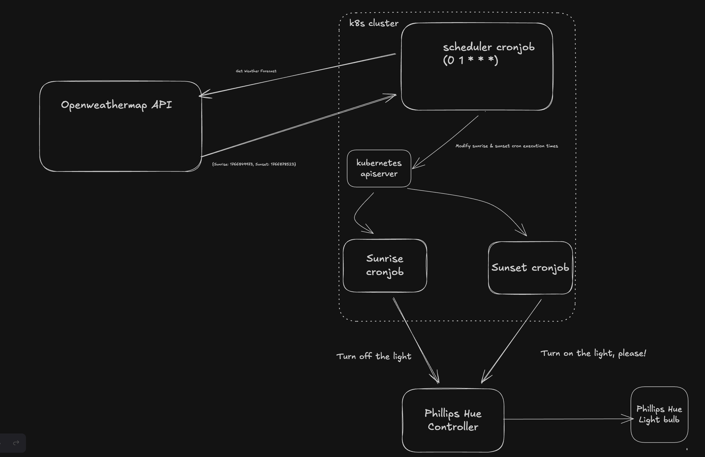

# k8s turn on the light

This project automates turning a Phillips Hue light on at sunset and off at sunrise. It uses kubernetes Cronjobs and the Kubernetes Go Client to accomplish this (see architecture diagram below).

The `scheduler` cronjob runs on a fixed time daily. It makes requests to the openweathermap API to fetch the weather forecast for a given day. It then parses the response to extract the forecast sunrise and sunset times, which are returned as Unix timestamps. The scheduler then uses the sunrise/sunset time to adjust the next execution of two other cronjobs, sunrise and sunset, by communicating with the apiserver.

The `sunrise` and `sunset` cronjobs are simple. They communicate with the Phillips Hue Bridge to request the light be turned on or off, at sunset or sunrise.

