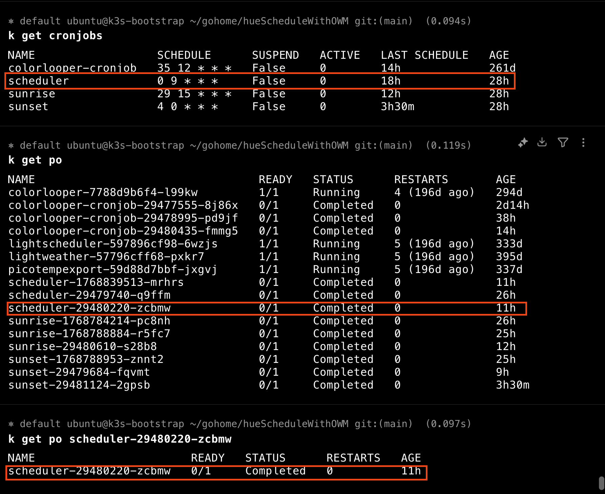
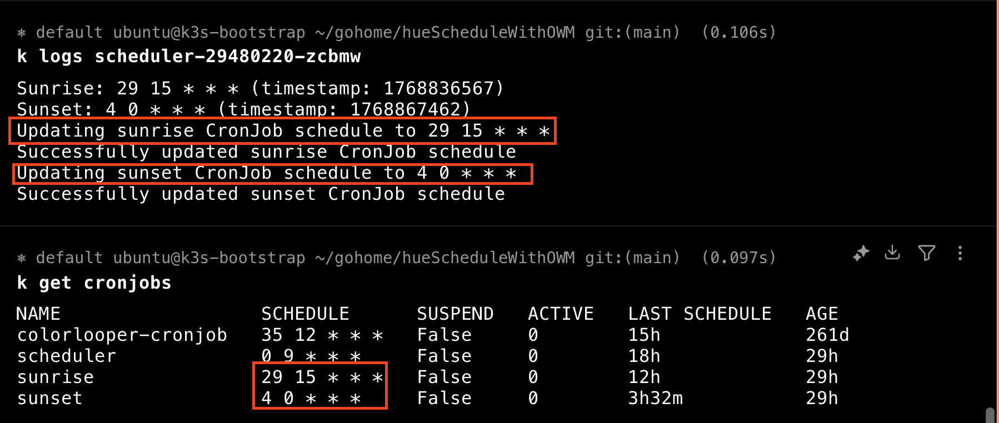

# Hue schedule with OpenWeatherMap

Automates Philips Hue lights so they turn **on at sunset** and **off at sunrise**, using real sunrise/sunset times from the OpenWeatherMap API. Everything runs on Kubernetes as CronJobs that adjust themselves daily.

## What it does

- **Sunset:** specified Hue lights are turned on when the sun sets (by your location).
- **Sunrise:** the same lights are turned off when the sun rises.

Sunrise and sunset times change through the year. This project updates the run times of the sunrise and sunset jobs every day using OpenWeatherMap, so you don’t have to maintain a fixed schedule.

## How it works

1. **Scheduler (once per day)**  
   A CronJob runs at a fixed time (e.g. 09:00). It:
   - Calls the OpenWeatherMap API for your configured location.
   - Reads today’s sunrise and sunset (Unix timestamps) from the response.
   - Converts them to cron expressions.
   - Updates the **sunrise** and **sunset** CronJob resources in the same namespace via the Kubernetes API so they run at those times.

2. **Sunrise CronJob**  
   Runs at the computed sunrise time and turns the configured Hue lights **off** (e.g. “lights off at dawn”).

3. **Sunset CronJob**  
   Runs at the computed sunset time and turns the configured Hue lights **on** (e.g. “lights on at dusk”).

So: one job sets the schedule; two jobs perform the actual on/off actions at the API-derived times.

## Components

| Component   | Role |
|------------|------|
| **scheduler** | Fetches weather (OpenWeatherMap), gets sunrise/sunset, updates the sunrise and sunset CronJob schedules in the cluster. |
| **sunrise**   | Talks to the Philips Hue bridge and turns the given lights **off**. Invoked by the sunrise CronJob. |
| **sunset**    | Talks to the Philips Hue bridge and turns the given lights **on**. Invoked by the sunset CronJob. |

- **pkg/scheduler** – Kubernetes client used by the scheduler to get/update CronJobs (in the same namespace, via `metadata.namespace` / `NAMESPACE`).
- **pkg/weather** – OpenWeatherMap response parsing and conversion of Unix timestamps to cron expressions.

## Configuration

**Scheduler CronJob**

- **NAMESPACE** – Set via Kubernetes downward API (`fieldRef: metadata.namespace`) so the scheduler updates CronJobs in its own namespace.
- **WEATHER_LOCATION** – OpenWeatherMap location query (e.g. `Calgary,CA`). Default: `Calgary,CA`.
- **OPENWEATHERMAP_API_KEY** – From a secret; required for the weather API.

**Sunrise / Sunset CronJobs**

- **HUE_ID**, **HUE_IP_ADDRESS** – From a secret; used to talk to the Philips Hue bridge.
- Light names are passed as container args (e.g. `["Front door", "Garage Outside"]`); those lights are turned off at sunrise and on at sunset.

## Deployment

Manifests live in **k8s/all.yaml**: ServiceAccount, RBAC (role to get/update the sunrise and sunset CronJobs), and the three CronJobs (scheduler, sunrise, sunset). Build and deploy with the included Dockerfiles and `deploy.sh` (or your own pipeline). Ensure the OpenWeatherMap API key and Hue credentials are created as secrets and referenced in the CronJob specs.

  
