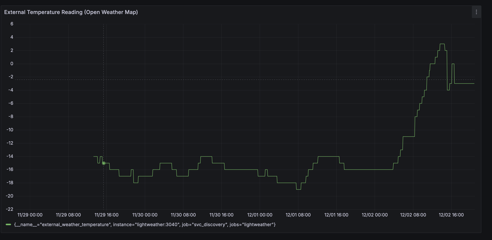

# Lighting Weather

This projects is a Go-based microservice for setting the color of a Phillips Hue lightbulb according to the external temperature. The service runs as a container and integrates the OpenweatherMap API and a Phillips Hue SDK to set the color of the light to match the external temperature according to thresholds defined in the `config.yml` file.

## Application Logic

The service runs a http server that listens for requests on `/`, `/refresh` and `/powerHueOff` endpoints. When a `POST` request is made to `/refresh`, the service sends a message to a  Goroutine that queries the openweathermap API for the current temperature and sets the color of the Phillips Hue lightbulb according to the temperature. The service also sends a message to the Goroutine every 30 minutes to essentially call a `refresh`

`POST` requests to the `/powerHueOff` endpoint will similarly push a message through a channel to a Goroutine that turns the lightbulb off.

A `/metrics` endpoint is exposed that can be scraped by Prometheus to collect `external_weather_temperature` from the service.

## Infrastructure

The microservice application runs as a container wrapped in a Pod/Deployment in a Kubernetes cluster. The pod is exposed within the cluster using a `clusterIP` service. An `ingress` object exposes the service outside the cluster using an `nginx` `ingress-controller`. The application integrates with an existing Prometheus/Grafana monitoring stack using a `serviceMonitor` object.

Below is a screenshot of the Grafana dashboard that monitors the external temperature readings from OpenWeatherMap.

## Configuration

The following configuration options can be provided through the `config.yml` file:

- unit: "C" or "F": preferred unit for temperature readings from Openweathermap
- language: preferred language for communication with the openweathermap API
- longitude: the longitude of the location for temperature readings (between -180 and 180)
- latitude: the latitude of the location for temperature readings (between -90 and 90)
- hue_id: a user ID on the hue bridge integrated with the lightbulb you wish to control
- hue_ip_address: IPV4 address of the phillips hue bridge
- owm_api_key: valid API keys for openweathermap.com (these can also be provided as environment variables to the container execution context)
- light_name: the name of the Phillips hue lightbulb to control (you can find this from the Phillips Hue app)
- colors: color gradients for temperature. Each gradient must be specified as a color and threshold (for example, color: orange, threshold 25 will set the color to orange for temperature values above 25 degree celsius)
